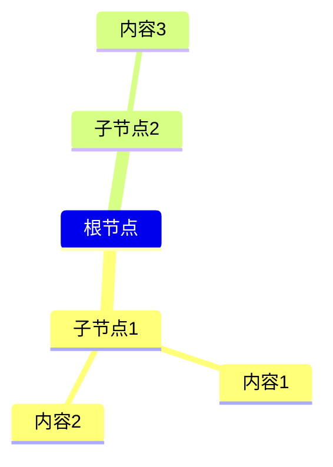

# 强制规则：内容处理与知识吸收工作流

> 触发词：链接、总结、这个视频、这个帖子、看看这个、学习
> 更新：2026-03-18
> 整合：内容总结可视化 + 外部知识吸收

---

## 触发条件

用户分享以下内容时：
- YouTube 链接
- X 帖子链接
- 网页链接
- 文章链接
- 用户说"看看这个"
- 用户粘贴大段文字
- 用户问如何学习

---

## 核心心法

> **不是问"内容讲了什么"**
> **而是问"这个能帮我解决什么问题"**

---

## 完整工作流（7步）

### Step 1：获取内容

1. 使用 WebFetch / browser 读取链接内容
2. 如果是 YouTube，使用 YouTube 技能获取字幕

### Step 2：验证价值（选内容）

| 验证方法   | 作用         |
| ------ | ---------- |
| 看评论/反馈 | 验证内容质量     |
| 看目录/大纲 | 确认有没有你要的内容 |
| 适合就继续  | 不适合就放弃     |

### Step 3：提取核心观点

用 AI 能力提取：
1. **核心观点（3-5条）** - 不是复述，是提炼
2. 思维导图结构
3. 关键信息点

**筛选标准：**

| 标准    | 问题           |
| ----- | ------------ |
| 和我有关  | 这个观点能用到哪？    |
| 颠覆认知  | 这个和我以前想的不一样？ |
| 能解释现象 | 这个能帮我理解什么？   |
| 可行动   | 这个能指导我做什么？   |

> **重点不是"漏掉多少"，而是"记住多少"**

### Step 4：对比分析

| 维度      | 问题              |
| ------- | --------------- |
| 我有什么？   | 我已经懂什么？这验证了我什么？ |
| 我缺什么？   | 这个补我哪块？         |
| 我能学什么？  | 哪些能立刻用？         |
| 我不需要什么？ | 哪些对我没用？         |

### Step 5：转化为行动

1-3个可执行改进点：

```
| 要做什么 | 为什么 | 怎么做 | 预期效果 |
|----------|--------|--------|----------|
|          |        |        |          |
```

### Step 6：画图（可选）

**建议做思维导图帮助理解，可选**

#### 方式一：Mermaid 思维导图

````markdown

````

#### 方式二：Markdown 结构

用结构化 Markdown：

```
## 思维导图

### 核心观点
- 观点1
- 观点2

### 分类1
- 内容A
- 内容B

### 分类2
- 内容C
```

### Step 7：保存到 Obsidian

**保存位置：** 按内容类型选择

| 内容类型 | 存到 |
|---------|------|
| 项目相关 | `1-项目/` |
| 投资理财 | `1-项目/投资理财/` 或 `2-领域/` |
| 技能学习 | `1-项目/学习/` |
| 知识笔记 | `1-项目/知识笔记/` |
| 随手记 | `3-资源/` |

**笔记结构：**
```
# [标题]

> 来源：链接
> 日期：YYYY-MM-DD

## 原文

## 核心观点
1. ...
2. ...

## 对比分析
- 我有什么：
- 我缺什么：
- 我能学什么：

## 行动清单
- [ ] ...

## 参考内容
[摘要/笔记]
```

---

## 常见问题解决

### 1. 不知道重点
→ 用"对比分析"：读之前先问"我缺什么？"

### 2. 记不住
→ 用"提取核心观点"：只记3-5个观点，不是整本书

### 3. 用不起来
→ 用"转化为行动"：读完后立刻写"要做什么"

### 4. 担心读错书/内容
→ 用"验证价值"：不适合就放弃

---

## 禁止行为

- ❌ 只读取不保存
- ❌ 复制原文不动脑
- ❌ 不提取观点
- ❌ 只看不记
- ❌ 只记不用
- ❌ 照搬照抄
- ❌ 从头读到尾（没有重点）

## 必须行为

- ✅ **提取3-5个核心观点**
- ✅ **提取核心观点并转化为行动**
- ✅ **保存到OB**
- ✅ **转化为行动**
- ✅ **对比分析**

---

## 关于时效性

| 类型     | 时效性 | 建议       |
| ------ | --- | -------- |
| 投资/心理学 | 低   | 经典永不过时   |
| 历史     | 低   | 规律重复     |
| 技术/工具  | 高   | 读新版或网上最新 |

**原则：基础原理不变，变的只是形式。**

---

## 原文引用

处理内容时，必须在笔记最后附上：

```
---

## 原文

> 来源：https://x.com/xxx
> 日期：YYYY-MM-DD

[原文内容或摘要]
```

**目的**：保留原文来源，方便后续查阅和验证。
