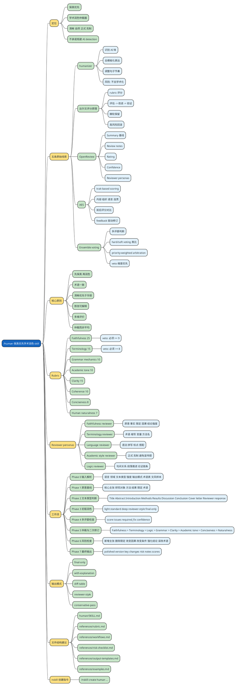

# `/human` skill 思维导图

```plantuml
@startmindmap
<style>
mindmapDiagram {
  node {
    BackgroundColor #F7F7F7
    BorderColor #455A64
    FontColor #263238
  }
  :depth(0) {
    BackgroundColor #1565C0
    FontColor white
  }
  :depth(1) {
    BackgroundColor #FFE082
  }
  :depth(2) {
    BackgroundColor #C8E6C9
  }
  :depth(3) {
    BackgroundColor #E3F2FD
  }
}
</style>
* /human 保真优先学术润色 skill
** 定位
*** 保真优先
*** 学术润色仲裁器
*** 清晰 自然 正式 克制
*** 不承诺规避 AI detection
** 五条原始线索
*** humanizer
**** 识别 AI 味
**** 去模板化表达
**** 调整句子节奏
**** 风险: 不去学术化
*** 达尔文评分原理
**** rubric 评分
**** 评估 -> 改进 -> 验证
**** 棘轮保留
**** 高风险回滚
*** OpenReview
**** Summary 基线
**** Review notes
**** Rating
**** Confidence
**** Reviewer personas
*** AES
**** trait-based scoring
**** 内容 组织 语言 连贯
**** 前后评分对比
**** feedback 驱动修订
*** Ensemble voting
**** 多评委判断
**** hard/soft voting 类比
**** priority-weighted arbitration
**** veto 维度优先
** 核心原则
*** 先保真 再润色
*** 术语一致
*** 清晰优先于华丽
*** 修改可解释
*** 多维评价
*** 仲裁而非平均
** Rubric
*** Faithfulness 25
**** veto: 必须 >= 9
*** Terminology 15
**** veto: 必须 >= 8
*** Grammar mechanics 10
*** Academic tone 10
*** Clarity 15
*** Coherence 10
*** Conciseness 8
*** Human naturalness 7
** Reviewer personas
*** Faithfulness reviewer
**** 原意 事实 限定 因果 结论强度
*** Terminology reviewer
**** 术语 缩写 变量 方法名
*** Language reviewer
**** 语法 拼写 标点 搭配
*** Academic style reviewer
**** 正式 克制 避免宣传腔
*** Logic reviewer
**** 句间关系 段落推进 论证链条
** 工作流
*** Phase 0 输入解析
**** 语言 领域 文本类型 强度 输出模式 术语表 文风样本
*** Phase 1 原意基线
**** 核心主张 研究对象 方法 结果 限定 术语
*** Phase 2 文本类型判断
**** Title Abstract Introduction Methods Results Discussion Conclusion Cover letter Reviewer response
*** Phase 3 初版润色
**** light standard deep reviewer-style final-only
*** Phase 4 多评委检查
**** score issues required_fix confidence
*** Phase 5 仲裁与二次修订
**** Faithfulness > Terminology > Logic > Grammar > Clarity > Academic tone > Conciseness > Naturalness
*** Phase 6 风险检查
**** 新增主张 删除限定 改变因果 改变条件 强化结论 误改术语
*** Phase 7 最终输出
**** polished version key changes risk notes scores
** 输出模式
*** final-only
*** with-explanation
*** diff-table
*** reviewer-style
*** conservative-pass
** 文件结构建议
*** human/SKILL.md
*** references/rubric.md
*** references/workflows.md
*** references/risk-checklist.md
*** references/output-templates.md
*** references/examples.md
** nskill 创建指令
*** /nskill create human ...
@endmindmap
```
